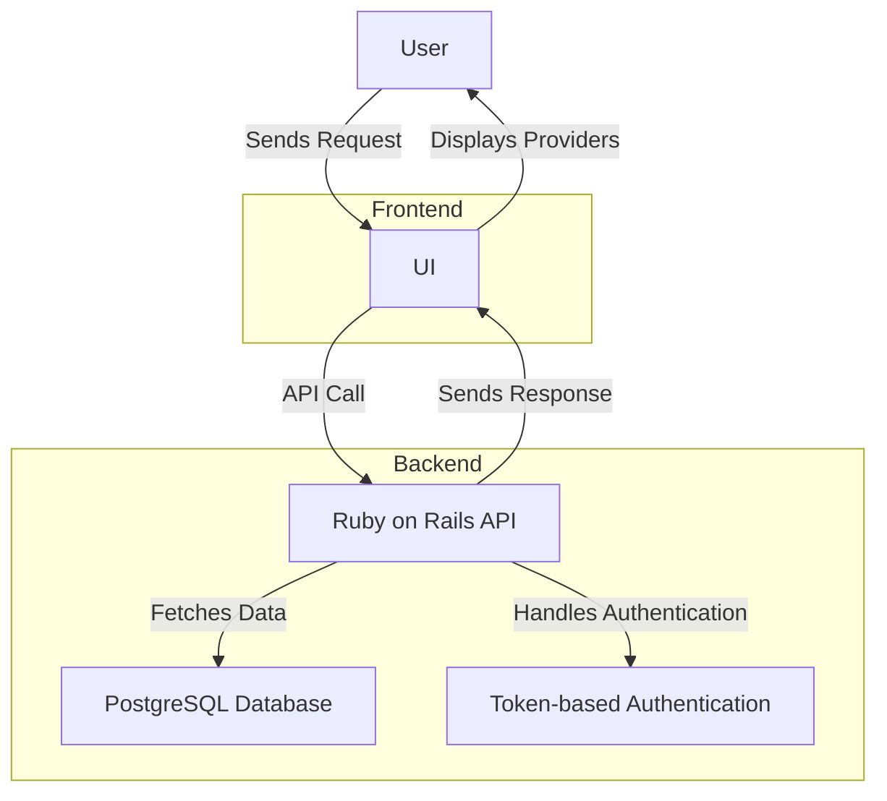

# Software Engineering Take-Home Exercise

Welcome to the Carrum Health take-home exercise! This project includes a boilerplate Rails application, React application, and Docker Compose file that represents a basic scaffold for candidates to use when completing our take-home exercise for software engineers.

The next steps will get you started with setting up the repository, while the [EXERCISE.md](./EXERCISE.md) file contains detailed requirements and guidelines for the assignment. We aim to make this as easy as possible, but we welcome any feedback to help improve the process!

## Prerequisites

[Docker](https://www.docker.com/)

## Getting Started

1. Clone the repository:
   ```sh
   git clone git@github.com:carrumhealth/software-engineering-code-exercise.git
   cd software-engineering-code-exercise
   ```

2. Build and start the services:
   ```sh
   docker compose up --build
   ```

3. Run Database Migrations
   ```sh
   docker compose exec api rails db:migrate
   ```
4. Create a User for Authentication
   ```sh
   docker compose exec api rails console
   User.create!(email: "admin@example.com", password: "password123", password_confirmation: "password123")
   ```

5. Env for UI
Create .env in /ui
   ```sh
   docker compose exec api rails console
   user = User.find_by(email: "test@example.com")
   user.api_token
   ```
Copy user.api_token and set to NEXT_PUBLIC_API_TOKEN.
Adn set NEXT_PUBLIC_API_URL to http://localhost:3000

6. Access the applications:
   - Rails API: http://localhost:3000
   - React UI: http://localhost:7500

## Tests
- UI: ```docker compose exec ui npm test```
- API: ```docker compose exec api bundle exec rspec```

## API Endpoints
| Method | Endpoint | Description |
| --- | --- | --- |
| GET | /providers | Get all active providers |
| GET | /providers/{id} | Get provider by ID |
| POST | /providers | Create a new provider |
| PUT | /providers/{id} | Update a provider |
| DELETE | /providers/{id} | Soft delete a provider |
| PUT | /providers/{id}/reactivate | Reactivate a provider |

## DB Schema
| User |  |
| --- | --- |
| id | int |
| string | email |
| string | password\_digest |
| string | api\_token |
| timestamp | created\_at |
| timestamp | updated\_at |

| Provider |  |
| --- | --- |
| int | id |
| string | name |
| string | speciality |
| string | npi |
| string | location |
| string | credentials |
| boolean | deactivated |
| timestamp | created\_at |
| timestamp | updated\_at |

## System Design



## Missing & future implementation
- Only admin account: There is no role based permission logic and 
- Limited Pagination: The API does not implement pagination yet.
- Basic Authentication: Manual user creating and token set
- No Rate Limiting: Does not include request throttling.
